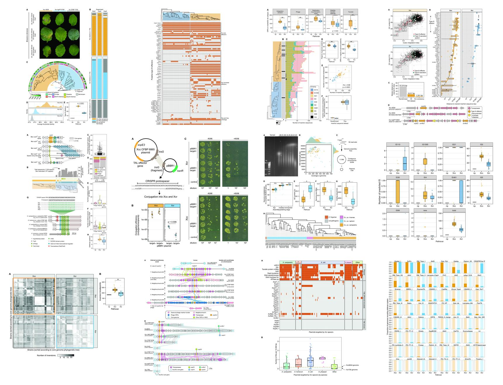

# *X. campestris* genomics study

This repository contains code and data related to the study by Paauw *et al.* (2024) on genomics of *X. campestris* ([Preprint](https://papers.ssrn.com/sol3/papers.cfm?abstract_id=4763864)). The scope of this repository is to serve as a scripts and data archive, rather than as a complete bacterial pangenomics tutorial or a detailed interpretation of all datasets and analysis steps. For the latter, we refer to our paper in *Current Biology* (see Reference below).

## Organization

The commands used to assemble and annotate the genomes can be found in the folder `A_genome_assembly`. The other folders are organized by figure, referring to the figure numbers of the Paauw *et al.* paper. For each figure, the documentation is divided by (i) the steps run on the University of Amsterdam compute cluster Crunchomics, and (ii) the steps to generate the plots shown in the figures. Some routine operations (e.g., concatenating results from 94 genomes into one table, sorting tables, subsetting columns) are not documented and are left as an exercise to the reader. During the study, the genomes of different isolates are referred to as 'barcode`xx`', with `xx` ranging from `00` to `96`. To map the barcode numbers to isolate name, use Table S1 and S2 in Paauw *et al.* paper.

## Contact

If you have any questions on this project, feel free to contact us:

* Misha Paauw (First author, University of Amsterdam, m.m.paauw@uva.nl)
* Sebastian Pfeilmeier (Co-supervisor, University of Amsterdam, j.s.pfeilmeier@uva.nl)
* Harrold van den Burg (Corresponding author and lead contact, University of Amsterdam, H.A.vandenBurg@uva.nl)

## Reference

If you used any data on this page, please cite the following study:

> Paauw, M., Schravesande, W. E., Taks, N. W., Rep, M., Pfeilmeier, S., & van den Burg, H. A. Loss of CRISPR-Cas Shaped the Evolution of the Plant Pathogen Xanthomonas campestris. Available at SSRN 4763864.
